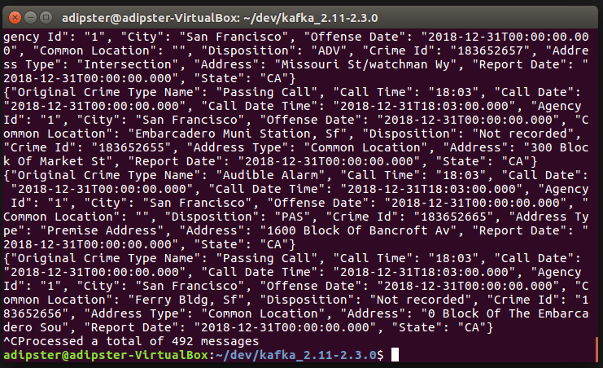
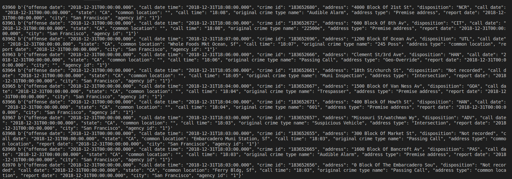
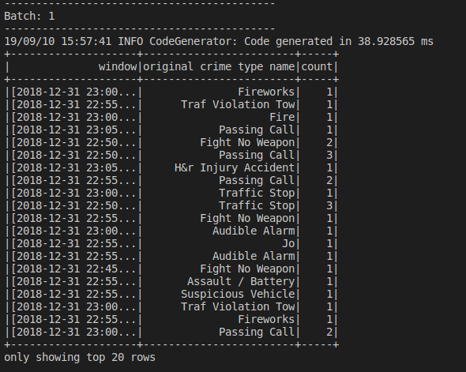

# SF Crime Statistics with Spark Streaming

## Project Setup

- To set up kafka, download the appropriate version (Kafka build with Scala 2.11.x) from the site https://kafka.apache.org/downloads

- install pykafka for producer_server.py `conda install -c conda-forge pykafka`
- cd kafka

### Run the following on Seperate Terminals
- bin/zookeeper-server-start.sh config/zookeeper.properties
- bin/kafka-server-start.sh config/server.properties

- python producer_server.py ( run this from the project root folder)

- bin/kafka-console-consumer.sh --bootstrap-server localhost:9092 --topic service-calls --from-beginning

- spark-submit --packages org.apache.spark:spark-sql-kafka-0-10_2.11:2.3.0 --master local[4] data_stream.py

After this setup of the working base, I completed `producer_server.py`. After running `python3 producer_server.py`, my producer_server was started and I was able to see the produced data from kafka consumer after running `bin/kafka-console-consumer.sh --bootstrap-server localhost:9092 --topic <your-topic-name> --from-beginning`. Below was my result:

I also wrote a `data_consumer.py` script to consume data produced from the kafka producer. Below was the result:

Upon completion of the `data_stream.py`, I ran `spark-submit --packages org.apache.spark:spark-sql-kafka-0-10_2.11:2.3.0 --master local[4] data_stream.py` and had several batch results on the console. Below is one of them:

